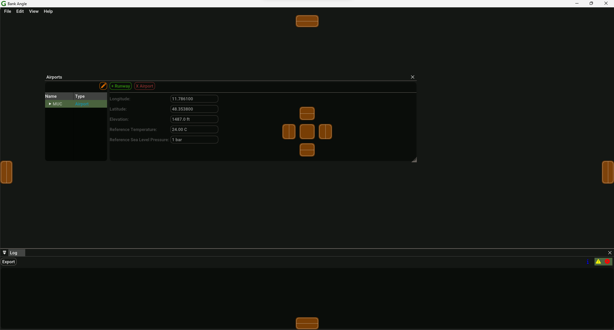

# Application

GRAPE implements the models used to calculate the environmental impacts of aircraft operations around airports. It focus solely on arrival and departure operations (taxi, overflight and circuit operations are currently not supported). Based on the same input data, noise, fuel consumption and pollutant emissions can be calculated.

A study in GRAPE can be defined as a collection of the input data and its associated databases, the defined scenarios and runs to apply the models to that data and the outputs that those runs produce. A study is saved as a single [SQLite](https://sqlite.org/) file with the *.grp* extension.

## GUI

The GUI provides user interactions to create, edit and delete all the data used by GRAPE, perform calculations and edit settings. The GUI is split into two main parts:

- [menu bar](#menu-bar): always located on top of the application window.
- [panels](#panels): can float anywhere in your screen and be docked into anywhere in the application.

### Menu Bar

The menu bar is always visible and serves to perform main interactions with the application such as opening and closing studies. The menu bar has the following sections:

- [File](#file)
- [Edit](#edit)
- [View](#view)
- [Help](#help)

#### File

This menu controls which GRAPE study is currently active and being worked on. There can only be one open study at a time. A GRAPE study is always associated with a [SQLite](https://sqlite.org/) database saved on the user computer. Therefore, when creating a new study, the user is prompted to choose the location to which this file will be saved. GRAPE keeps all the changes effectuated via the GUI in sync with the study file, rollback of changes is not yet supported.

Additionally, two operations on the GRAPE study can be performed:

- Integrity check: verify if all constraints and relations are in place regarding the data currently saved in the study. This will always be the case if data is only edited via the GUI.
- Vacuum: as you add data to the study, its size will increase. After deleting a significant amount of data from a large study, vacuum it to reduce the file size accordingly.

#### Edit

This menu allows for:

- importing data: check the [IO Section](../IO/index.md)
- exporting data: check the [IO Section](../IO/index.md)
- clearing all outputs: this will delete all the outputs from a study, therefore reducing the study size. Consider using when moving large studies. 
- changing the application [settings](#settings)

#### View

In this menu the different panels can be made visible or hidden. The panels are split into types:

- datasets
- input data
- scenarios, where all the runs are performed and outputs shown
- log panel

#### Help

Provides general information about the software and access to the documentation.

### Panels

The panels of the application provide the user with information or enable the user to edit input data and run calculations. Every panel in GRAPE can be moved to any desired position on the screen, docked into another panel or into the main window or closed if not needed.

??? info
	Panels can be enabled and disabled in the `View` section of the menu bar. Clicking the `x` at the top right of each panel will disable it.

There are two main types of panels in GRAPE. The first type presents data in form of tables, without any sort of hierarchical structure. This is ideal for simple data structures, where each record can be given in a single row. This is currently applied to the following panels:

- SFI
- Fleet
- Flights

The second type of panel presents data that has some form of hierarchy associated. A good example is the airport structure. An airport can have any number of runways, which in turn can have any number of arrival or departure routes. This type of data has two components, its hierarchy and the data itself. Panels for this type of data present the hierarchy on the left in form of a tree structure and the data on the right. The presented data is dependent on the currently selected node in the tree structure.

??? info
	In a tree structure, the selected node is always highlighted.

## Settings

The application settings are unique to each GRAPE installation. They are not saved in a study or transferable across computers. The settings are not changed by opening and closing studies or the application.

### Global

These settings control the global behaviour of different features in GRAPE. For calculating route outputs, the following can be tweaked:

- Arc Interval: the interval at which points are added for vector and RNP routes turns.
- Heading change warning: the threshold to produce a warning if a point is added to the route output during calculations which changes the heading by more than a certain amount.
- RNP RF leg radius delta warning: RNP radius to fix legs have in general a very similar start and end radius (distances between start and end of the turn to the turn center). This setting sets the threshold to warn the user in case the start and end radius differ.

For importing ANP data, the following can be controlled:

- Create fleet entries: in addition to importing the ANP data to the GRAPE Doc29 data, create fleet entries for each ANP aircraft.
- 'Descend' step as 'Descend Land' step altitude threshold: GRAPE introduces the 'Descend Land' step, which is not directly present in the ANP database. Some profiles in the ANP database may have descend steps to relative low altitudes followed by a landing step. This setting defines which 'Descend' steps in the ANP database will be recognized as the 'Descend Land' step.

### Units

All variables stored in a GRAPE study are stored in SI. However, for visualisation in the GUI, exporting of data and fallback when importing data, different units can be defined here. Besides the units, the number of decimal places shown in the GUI can also be defined.
